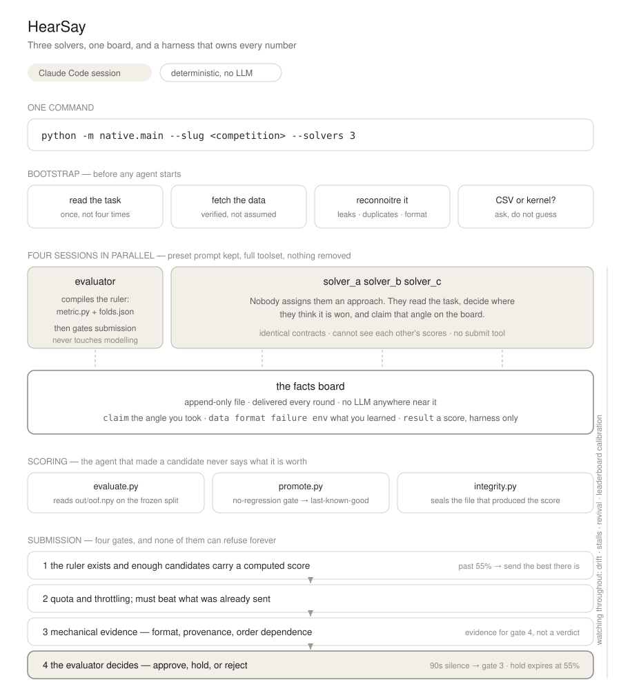

# IOAI 2026 — AI Models Track Agent

An **autonomous agentic system** for the [IOAI² AI Models Track](https://ioai-official.org/ai-model-track/)
(IOAI 2026). The goal of the track: an AI system that **writes, runs, and submits
ML code by itself** on expert-designed olympiad ML tasks — a human only presses
"start", no human touches the solution during the run.

This repo is that system, currently built out and validated end-to-end on the
first practice task (**Audio Classifier**, a class-incremental learning problem).

---

## Which system to run

Three generations live in this repo. **HearSay is the current one; use it.**

    python -m native.main --mode competition --slug <competition> --solvers 3 \
        --deadline-min 120 --max-cost-usd 100 --max-submissions 4

See [`native/README.md`](native/README.md) for the design and, more usefully,
for which failure produced each decision in it.

The current revision adds an **Evidence Firewall** around HearSay. Use
`--mode competition` for a real timed run with sparse post-submission
calibration, or `--mode clean-benchmark` to seal leaderboard and web feedback
from every candidate lineage. Both modes freeze the model, budget, routes,
data contract, and submission authority before work starts.

| | where | status |
|---|---|---|
| **HearSay** — 3 parallel Claude Code solvers, a facts board, a deterministic harness | `native/` | **current** |
| multiagent-sdk — one SDK client driving stateless subagents | `magent/` | superseded |
| outer agent v0 — single-agent 8-phase orchestrator | `agent/` | superseded; its tool registry is still shared |

## Results

First place on both IOAI 2025 mirrors, 2026-08-01:

| task | local (OOF) | leaderboard | previous best on that board |
|---|---|---|---|
| `radar-ioai-2025` | 0.98601 | **0.98756** | 0.98723 |
| `ioai-2025-chicken-counting-mirror-unofficial` | 0.918652 | **0.93156** | 0.93002 |

Read those margins carefully. Radar's test set has a bootstrap sampling
deviation of ~0.00036 and we lead by 0.00033; chicken's test set is smaller
still. **Both leads sit inside noise** — the honest claim is "competitive with
the best public entry", not "better than it".

The reproducibility is the stronger result: two independent radar runs, with
different sessions and different model choices, landed at 0.98756 and 0.98716.

For contrast, the earlier single-agent system on Practice Task 1 scored 0.9156
on a local holdout and **0.78095** on the leaderboard. Closing that gap — making
the local number mean something — is most of what HearSay is for.

## What made the difference

Measured, not assumed:

- **The kernel was being crippled.** The previous branch replaced Claude Code's
  preset system prompt, passed `setting_sources=[]`, and gave subagents a tool
  whitelist. All three are undone here; a live probe confirms the full toolset,
  WebSearch included.
- **Nothing assigns approaches.** Solvers read the task and claim their own
  angle on the board. A version that pre-assigned model/data/calibration aimed
  two of three solvers at ground that had nothing in it.
- **Scores come from scripts, never from the agent that produced them.**
- **Claims, adoptions, conflicts, results, and decisions carry stable fact IDs
  and evidence references.** A route cannot cite itself as “collaboration.”
- **A candidate is not just a CSV.** OOF predictions, folds, code/config hashes,
  sample-locality probes, coordination receipts, and taint state are sealed
  together; a failed gate retains the last-known-good candidate.
- **Every gate that can refuse has a point past which it cannot.** Three runs
  were lost to gates that could say no indefinitely.
- **The leaderboard score comes back.** The run learns whether its own
  measurements are trustworthy — on radar the local number ran 0.0012 below the
  board, on chicken 0.0129 below.

## Earlier status (Practice Task 1, single-agent era)

**What works today**
- ✅ End-to-end pipeline on Practice Task 1, fully offline on a local GPU:
  data pull → cache frozen features → **autonomous experiment loop** → build a
  Kaggle notebook → submit → real score.
- ✅ The **autonomous loop** (`src/agent_loop.py`): each iteration the agent
  (Claude Opus 4.8) *decides and codes* the next experiment; the harness runs it,
  scores it with the official metric on a local holdout, and feeds the result
  (or the crash traceback) back so it self-corrects. **No human proposes
  experiments.**
- ✅ **Standalone**: `python run.py …` runs the whole thing without Claude Code.
- ✅ First real Kaggle submission scored (code-competition notebook path verified).
- ✅ **Outer agent v0** (`agent/`): 8-phase autonomous orchestrator (read task →
  plan → build its own scaffolding → floor submit → experiment → report) with a
  **pluggable LLM backend**, sandboxed tools, persistent memory/skills, budgets
  and full tracing. `python -m agent.main --slug <comp> --brief task.md` is the
  human's only action. Autonomous end-to-end validation on Task 1 in progress.

**Results — Practice Task 1**

| Measure | Score |
|---|---|
| Hand-written baseline (freeze old head, train new) | 0.763 *(local holdout)* |
| Agent's best decision (aug features + frozen-head logits → balanced LogReg) | **0.9156** *(local holdout)* |
| **Kaggle public leaderboard** (that submission) | **0.78095** |

**Known limitations (next work)**
1. **Local CV is optimistic (~0.13 gap).** The holdout is small/high-variance, so
   the agent partly optimizes noise — later iterations *regressed* by "fixing"
   classes that only looked broken due to 1–2 unlucky holdout samples.
   → Fix: k-fold CV + a significance gate before accepting a new best.
2. **Only the *inner* loop is autonomous.** The task-specific scaffolding
   (feature extraction, the metric, the submission notebook) is currently
   **hand-written for this task**. A brand-new task (e.g. Practice Task 2) has no
   such scaffold, so the system is **not yet autonomous for an unseen task**.
   → Fix: an *outer* agent that reads a fresh task and writes that scaffolding
   itself, then runs the inner loop.

---

## Architecture



Four Claude Code sessions run at once, none of them told what to do. Three
solvers read the task, decide for themselves where they think it is won, and
claim that angle on a shared board so the others take a different one. The
fourth compiles the ruler everybody is measured with, then guards the door.

Everything that decides anything is a script. The agent that produced a
candidate never says what it is worth; `evaluate.py` reads its predictions on a
frozen split and computes the number. Nothing is submitted until four gates
agree, and every gate has a point past which it can no longer refuse — three
separate runs were lost to gates that could say no indefinitely.

The design notes worth reading are in **[native/README.md](native/README.md)**,
which records for each decision the failure that produced it.

### Where the pieces live

| | |
|---|---|
| `native/main.py` | launcher, round loops, submission policy, supervision |
| `native/facts.py` | the board — append-only, provenance-gated, two layers |
| `native/prompts.py` | the contract appended to Claude Code's preset prompt |
| `native/supervise.py` | drift reconciliation, stall detection, urgent delivery |
| `native/evidence.py` | immutable run contract, clean/competition modes, taint and reveal receipts |
| `native/scripts/` | recon · folds · evaluate · promote · integrity · coordination · sample locality · system A/B benchmark |
| `native/monitor.py` | `./watch` — the board first, stuck gates above it |
| `native/selftest.py` | 163 checks against hand-computed values |
| `skills/validation-split/` | how to cut a split, loaded by the evaluator |

### Three things it does differently

**The kernel is left alone.** Claude Code's preset system prompt is kept and
appended to rather than replaced, settings load normally, and the built-in
toolset is untouched. The previous branch did all three the other way; a live
probe now confirms the full toolset, WebSearch included.

**Nobody is assigned an approach.** An earlier version handed one solver the
model, one the data, one calibration — decided before anyone had read the task.
On chicken counting the win was that the metric is asymmetric and the target is
just the density map's sum, which is none of those three.

**No agent can submit.** The evaluator decides which candidate goes and when;
the harness sends it, so the shared quota is counted in one place. When solvers
held that power, all three bought insurance inside four minutes and spent a
whole day's allowance before the metric even existed.

---

## Quickstart

```bash
pip install -r requirements.txt

# credentials — never committed
cp .env.example .env                              # ANTHROPIC_API_KEY
mkdir -p ~/.kaggle && printf 'KGAT_...' > ~/.kaggle/access_token
chmod 600 ~/.kaggle/access_token

python -m native.selftest                         # 163 checks, no API calls

export CUDA_VISIBLE_DEVICES=4,5,6,7               # only cards that are yours
python -m native.main --mode competition --slug <competition> --solvers 3 \
    --deadline-min 120 --max-cost-usd 100 --max-submissions 4
```

That command is the only human action. Watch it with `./watch`, and read
**[RUNBOOK.md](RUNBOOK.md)** before leaving one running unattended — it covers
the killswitch, sweeping backgrounded training out of the workspace, and the
several ways a run has failed to stop cleanly here.

---

## Layout

| Path | Role |
|---|---|
| `run.py` | Standalone entry point: features → loop → notebook → submit |
| `src/agent_loop.py` | **The autonomous loop** — agent decides & codes each experiment |
| `src/llm.py` | Anthropic client (Opus 4.8, adaptive thinking, streaming) |
| `src/metric.py` | Official metric `0.5·acc_old + 0.5·acc_new` (the objective verifier) |
| `tasks/<t>/CARD.md` | Task spec |
| `tasks/<t>/features.py` | One-time frozen-encoder feature extraction + cache |
| `tasks/<t>/solve.py` | Hand-written reference baseline (superseded by the loop) |
| `tasks/<t>/kernel/` | Kaggle submission notebook (template + generated) |
| `tasks/<t>/runs/` | The agent's experiment history + best *(gitignored)* |
| `RUNBOOK.md` | Operator manual |

Data, feature caches, and run artifacts are gitignored — clone is code-only.

---

## Task 1 in one paragraph

Class-incremental audio classification. You get a frozen Audio Spectrogram
Transformer trained on **16 base sound classes** and must extend it to **29**
(add 13 new classes) in a single forward pass **without forgetting the old 16**,
reusing the checkpoint's encoder, within a ~10-minute training budget. Scored as
`0.5·(old-class accuracy) + 0.5·(new-class accuracy)` — forgetting is exactly as
costly as failing to learn. See [tasks/task1_audio/CARD.md](tasks/task1_audio/CARD.md).

---

## Competition context

IOAI² AI Models Track runs during IOAI 2026 (Astana, 2–8 Aug 2026); competition
sessions 4 & 6 Aug, on Kaggle, 6-hour windows, 3 problems each. All tools must be
declared; humans may only initiate the run; efficiency (tokens, cost, iterations)
is reported. Practice tasks are for wiring up the Kaggle submission path and do
not affect ranking.
