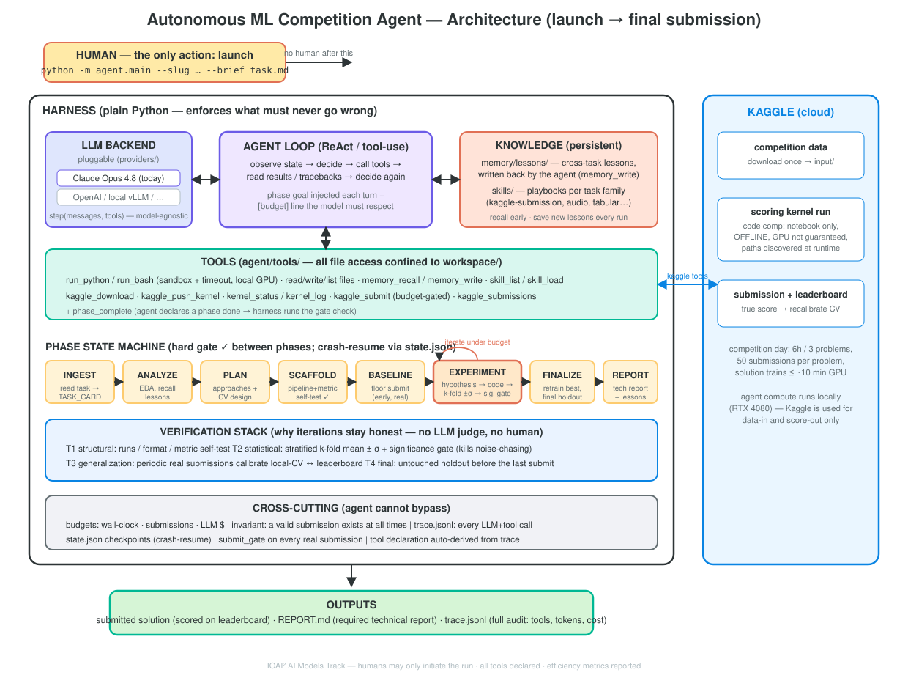

# IOAI 2026 — AI Models Track Agent

An **autonomous agentic system** for the [IOAI² AI Models Track](https://ioai-official.org/ai-model-track/)
(IOAI 2026). The goal of the track: an AI system that **writes, runs, and submits
ML code by itself** on expert-designed olympiad ML tasks — a human only presses
"start", no human touches the solution during the run.

This repo is that system, currently built out and validated end-to-end on the
first practice task (**Audio Classifier**, a class-incremental learning problem).

---

## Status (honest snapshot)

**What works today**
- ✅ End-to-end pipeline on Practice Task 1, fully offline on a local GPU:
  data pull → cache frozen features → **autonomous experiment loop** → build a
  Kaggle notebook → submit → real score.
- ✅ The **autonomous loop** (`src/agent_loop.py`): each iteration the agent
  (Claude Opus 4.8) *decides and codes* the next experiment; the harness runs it,
  scores it with the official metric on a local holdout, and feeds the result
  (or the crash traceback) back so it self-corrects. **No human proposes
  experiments.**
- ✅ **Standalone**: `python run.py …` runs the whole thing without Claude Code.
- ✅ First real Kaggle submission scored (code-competition notebook path verified).
- ✅ **Outer agent v0** (`agent/`): 8-phase autonomous orchestrator (read task →
  plan → build its own scaffolding → floor submit → experiment → report) with a
  **pluggable LLM backend**, sandboxed tools, persistent memory/skills, budgets
  and full tracing. `python -m agent.main --slug <comp> --brief task.md` is the
  human's only action. Autonomous end-to-end validation on Task 1 in progress.

**Results — Practice Task 1**

| Measure | Score |
|---|---|
| Hand-written baseline (freeze old head, train new) | 0.763 *(local holdout)* |
| Agent's best decision (aug features + frozen-head logits → balanced LogReg) | **0.9156** *(local holdout)* |
| **Kaggle public leaderboard** (that submission) | **0.78095** |

**Known limitations (next work)**
1. **Local CV is optimistic (~0.13 gap).** The holdout is small/high-variance, so
   the agent partly optimizes noise — later iterations *regressed* by "fixing"
   classes that only looked broken due to 1–2 unlucky holdout samples.
   → Fix: k-fold CV + a significance gate before accepting a new best.
2. **Only the *inner* loop is autonomous.** The task-specific scaffolding
   (feature extraction, the metric, the submission notebook) is currently
   **hand-written for this task**. A brand-new task (e.g. Practice Task 2) has no
   such scaffold, so the system is **not yet autonomous for an unseen task**.
   → Fix: an *outer* agent that reads a fresh task and writes that scaffolding
   itself, then runs the inner loop.

---

## Architecture



Full design rationale: [DESIGN.md](DESIGN.md).

## How it works

```
                OUTER agent  (v0 built ✅ — agent/)
   read a fresh task → write data-loading / features / metric / notebook
   8 phases: INGEST→ANALYZE→PLAN→SCAFFOLD→BASELINE→EXPERIMENT→FINALIZE→REPORT
   pluggable LLM backend · tools · memory/skills · budgets · trace
                              │ (subsumes)
                              ▼
   INNER loop  (built ✅)  — src/agent_loop.py (legacy standalone form)
   ┌─ each iteration ─────────────────────────────────────┐
   │ agent sees: task + metric + its own past experiments  │
   │        ↓ decides + writes fit_predict code            │
   │ harness runs it on cached features                    │
   │        ↓ scores on a fixed holdout (official metric) ★│  ← objective, no human/LLM judge
   │        ↓ feeds score / traceback back                 │
   │ agent self-corrects  (generate → run → verify → fix)  │
   └───────────────────────────────────────────────────────┘
                              │
        take agent's best → build Kaggle notebook → submit → real score
```

The agent talks to the Anthropic API directly (`src/llm.py`, model `claude-opus-4-8`).
Claude Code was only the development environment — it is **not** required to run.

---

## Quickstart

```bash
export PATH="/path/to/python-with-deps:$PATH"     # needs a GPU + torch
pip install -r requirements.txt

# credentials (never committed)
cp .env.example .env                              # paste ANTHROPIC_API_KEY
mkdir -p ~/.kaggle && printf 'KGAT_...' > ~/.kaggle/access_token && chmod 600 ~/.kaggle/access_token

# one command: features → agent loop → build notebook → submit → score
python run.py --task task1_audio \
    --slug ioai-2026-ai-models-track-practice-task-1 --iters 6 --submit
```

Drop `--submit` for a dry run. Just the offline decision loop (no Kaggle):
`python src/agent_loop.py --task task1_audio --iters 6`.
Full operator manual: **[RUNBOOK.md](RUNBOOK.md)**.

---

## Layout

| Path | Role |
|---|---|
| `run.py` | Standalone entry point: features → loop → notebook → submit |
| `src/agent_loop.py` | **The autonomous loop** — agent decides & codes each experiment |
| `src/llm.py` | Anthropic client (Opus 4.8, adaptive thinking, streaming) |
| `src/metric.py` | Official metric `0.5·acc_old + 0.5·acc_new` (the objective verifier) |
| `tasks/<t>/CARD.md` | Task spec |
| `tasks/<t>/features.py` | One-time frozen-encoder feature extraction + cache |
| `tasks/<t>/solve.py` | Hand-written reference baseline (superseded by the loop) |
| `tasks/<t>/kernel/` | Kaggle submission notebook (template + generated) |
| `tasks/<t>/runs/` | The agent's experiment history + best *(gitignored)* |
| `RUNBOOK.md` | Operator manual |

Data, feature caches, and run artifacts are gitignored — clone is code-only.

---

## Task 1 in one paragraph

Class-incremental audio classification. You get a frozen Audio Spectrogram
Transformer trained on **16 base sound classes** and must extend it to **29**
(add 13 new classes) in a single forward pass **without forgetting the old 16**,
reusing the checkpoint's encoder, within a ~10-minute training budget. Scored as
`0.5·(old-class accuracy) + 0.5·(new-class accuracy)` — forgetting is exactly as
costly as failing to learn. See [tasks/task1_audio/CARD.md](tasks/task1_audio/CARD.md).

---

## Competition context

IOAI² AI Models Track runs during IOAI 2026 (Astana, 2–8 Aug 2026); competition
sessions 4 & 6 Aug, on Kaggle, 6-hour windows, 3 problems each. All tools must be
declared; humans may only initiate the run; efficiency (tokens, cost, iterations)
is reported. Practice tasks are for wiring up the Kaggle submission path and do
not affect ranking.
